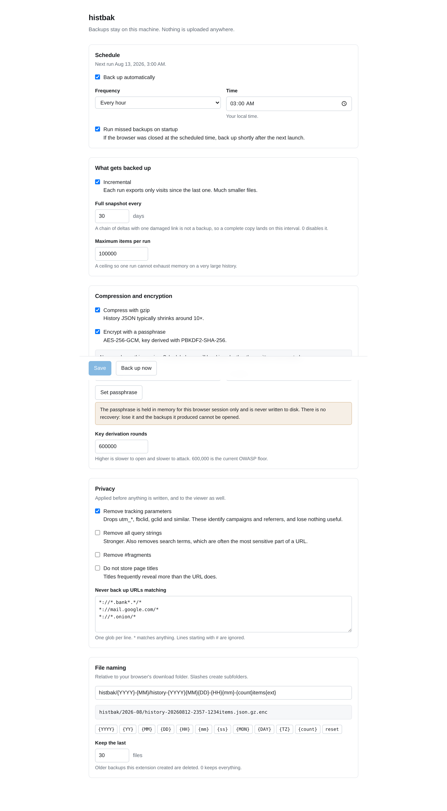
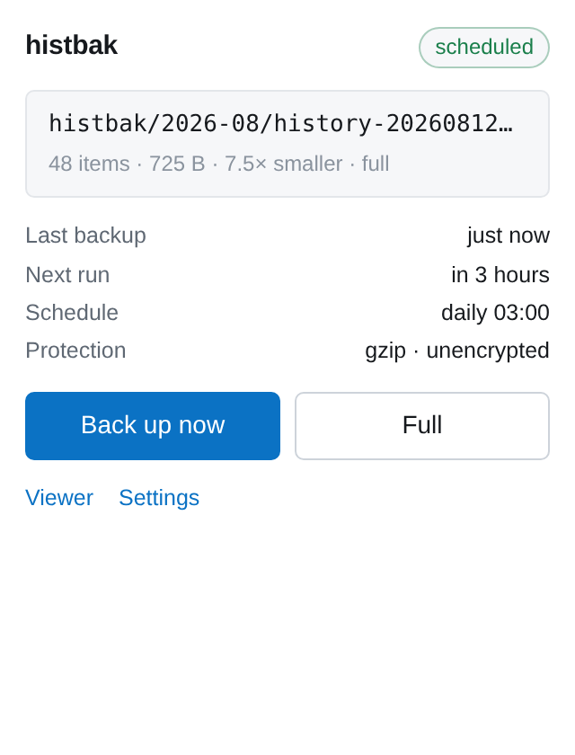

# histbak

Scheduled backups of your browsing history, plus a viewer that makes the history
readable. Everything runs locally. Nothing is uploaded anywhere, and the
extension makes no network requests at all.

Chrome and Firefox, Manifest V3, no runtime dependencies.


## Why

Browser history is the one part of a browser profile with no export worth using
and no backup at all. A profile corruption, a full disk, or a reinstall takes
years of it with no warning. Meanwhile the history that survives is only
browsable as a flat reverse-chronological list, which answers almost no question
you would actually ask of it.

histbak writes the history to disk on a schedule, and reads it back as something
you can look at.

## Disclaimer

This is personal software, published in case it is useful to someone else. It
carries no warranty of any kind. Read this section before trusting it with
anything.

### It is not a backup strategy on its own

Files land in your download folder, on the same disk as the profile they came from. A disk failure
takes both. If the history matters, copy the output somewhere else.

### Verify your backups

Open one in the viewer, or with the standalone script below, and confirm it contains what you expect. Do that before you need it, not
after. An untested backup is a guess.

### A lost passphrase is unrecoverable

There is no reset, no hint, and no back door. Files encrypted with a forgotten passphrase are permanently unreadable.
This is a property of the design rather than an oversight.

### Backups contain your history in full

Unencrypted output is plain JSON that anyone with the file can read. Consider where the download folder is,
whether it syncs to a cloud service, and who else uses the machine.

### Pruning deletes files

With `keepLastN` set, old backups are removed from disk. It matches on the extension's own filenames, but it is still a delete
operation running unattended. Set it to 0 to disable.

### Not audited

The cryptography uses standard WebCrypto primitives in a conventional arrangement, and the format is documented below and covered by
tests. That is not the same as review by a cryptographer.

The extension is unsigned and unlisted. It runs as an unpacked developer
extension, which Chrome will warn about on every start.

## Install

No store listing. Build it and load it unpacked.

```bash
git clone https://github.com/didvc/histbak
cd histbak
npm install
npm run build
```

Chrome, Edge, Brave:

1. Open `chrome://extensions`
2. Turn on Developer mode
3. Load unpacked, and select `build/chrome`

Firefox:

1. Open `about:debugging#/runtime/this-firefox`
2. Load Temporary Add-on
3. Select `build/firefox/manifest.json`

A temporary add-on is removed when Firefox restarts. A permanent install needs a
build signed through AMO.

## Backups

A run collects history, applies the privacy filters, wraps the result in an
envelope carrying its date range and counts, compresses it, optionally encrypts
it, and writes it to your download folder.

Runs are incremental by default: each one exports only what changed since the
last. A full snapshot lands every 30 days regardless, because a long chain of
deltas with one damaged link is not a backup.

Scheduling uses one-shot alarms re-armed after each run rather than a repeating
interval. A fixed 24-hour period drifts off the wall clock at every DST
transition, so `03:00 daily` would slowly become 02:00. If the browser was closed
at the scheduled time, the run happens shortly after the next launch.



## Encryption

Off by default, because turning it on has a consequence worth understanding
first: a forgotten passphrase means a dead archive.

When on, files are AES-256-GCM with a key derived by PBKDF2-SHA-256 at 600,000
rounds, which is the current OWASP floor. Salt and IV are random per file. The
header carrying the algorithm and round count is authenticated as GCM additional
data, so a file altered to claim one KDF round fails to decrypt rather than
becoming cheap to attack.

The passphrase is held in session storage and never written to disk. It is lost
when the browser closes. A scheduled run with encryption on and no passphrase
entered is skipped and reported, never quietly written in the clear.

Compression happens before encryption. Ciphertext does not compress, so the
other order would produce files larger than the input.



## Privacy filters

Applied before anything reaches disk, and to the viewer as well.

Tracking parameters such as `utm_*`, `fbclid` and `gclid` are stripped by
default, since they identify campaigns and referrers and lose nothing useful.
Optionally the whole query string can go, which also removes search terms.
Titles can be dropped entirely; they often reveal more than the URL. URLs
matching your exclude globs never leave the browser, and local schemes such as
`chrome://`, `file://` and `data:` are never recorded.

Exclude patterns are globs with `*`, one per line, matched against the whole URL:

```
*://*.bank*.*/*
*://mail.google.com/*
*://*.onion/*
*://localhost:*/*
```

## File naming

Backups are written under your download folder using a template:

```
histbak/{YYYY}-{MM}/history-{YYYY}{MM}{DD}-{HH}{mm}-{count}items{ext}
```

| Token | Meaning |
| --- | --- |
| `{YYYY}` `{YY}` | year |
| `{MM}` `{DD}` | month, day |
| `{HH}` `{mm}` `{ss}` | hour, minute, second |
| `{MON}` `{DAY}` | short month and weekday names |
| `{TZ}` | UTC offset, for files shared across timezones |
| `{count}` | number of items in this backup |
| `{ext}` | extension matching the pipeline used |

Everything resolves in local time. Slashes create subfolders. Templates are
sanitised: a pattern containing `..` cannot escape the download directory,
Windows-illegal characters are replaced, and reserved device names such as `con`
are prefixed. Unknown tokens are left visible rather than silently dropped, so a
typo is obvious in the preview.

## Reading a backup

The viewer opens backup files directly. Pick one or several from `Open backup…`
and it decrypts, decompresses and renders them with the same charts as live
history. Opening a full snapshot together with the increments that followed
merges them, newest record per URL winning.

Layers are detected by content rather than by file extension, so a renamed file
still opens.

## Opening a backup without the extension

A backup you can only read with the tool that wrote it is a hostage. The format
is plain gzip and standard AES-GCM, so this script recovers one with nothing but
Node:

```js
// node open-backup.mjs <file> [passphrase]
import { readFileSync } from "node:fs";
import { gunzipSync } from "node:zlib";
import { webcrypto as crypto } from "node:crypto";

const [file, passphrase] = process.argv.slice(2);
let bytes = new Uint8Array(readFileSync(file));

const MAGIC = "HISTBAK1";
if (Buffer.from(bytes.slice(0, 8)).toString() === MAGIC) {
  const view = new DataView(bytes.buffer, bytes.byteOffset, bytes.byteLength);
  const iterations = view.getUint32(10, false);
  const salt = bytes.slice(14, 30);
  const iv = bytes.slice(30, 42);
  const header = bytes.slice(0, 42);          // authenticated, must be passed in
  const material = await crypto.subtle.importKey(
    "raw", new TextEncoder().encode(passphrase.normalize("NFKC")),
    "PBKDF2", false, ["deriveKey"]);
  const key = await crypto.subtle.deriveKey(
    { name: "PBKDF2", salt, iterations, hash: "SHA-256" },
    material, { name: "AES-GCM", length: 256 }, false, ["decrypt"]);
  bytes = new Uint8Array(await crypto.subtle.decrypt(
    { name: "AES-GCM", iv, additionalData: header }, key, bytes.slice(42)));
}

if (bytes[0] === 0x1f && bytes[1] === 0x8b) bytes = gunzipSync(bytes);
const envelope = JSON.parse(Buffer.from(bytes).toString("utf8"));
console.log(envelope.kind, envelope.items.length, "items");
console.log(envelope.items.slice(0, 5));
```

An unencrypted backup needs even less:

```bash
gunzip -c history-20260812-0300-915items.json.gz | jq '.items | length'
```

## Backup file format

Unencrypted output is gzipped JSON. Encrypted output wraps those bytes in a
42-byte header followed by AES-GCM ciphertext with its tag appended:

| Offset | Bytes | Field |
| --- | --- | --- |
| 0 | 8 | magic, `HISTBAK1` |
| 8 | 1 | KDF id, 1 = PBKDF2-SHA-256 |
| 9 | 1 | cipher id, 1 = AES-256-GCM |
| 10 | 4 | iteration count, uint32 big-endian |
| 14 | 16 | salt |
| 30 | 12 | IV |
| 42 | n | ciphertext, GCM tag appended |

The whole header is passed as GCM additional data, so none of it can be modified
without decryption failing.

The JSON envelope inside:

```json
{
  "format": "histbak",
  "version": 1,
  "kind": "full",
  "createdAt": 1786000000000,
  "range": { "from": 0, "to": 1786000000000 },
  "counts": { "collected": 920, "kept": 915 },
  "filters": { "stripTracking": true, "stripQuery": false, "excluded": 5 },
  "items": [
    {
      "url": "https://example.com/page",
      "title": "Example",
      "lastVisitTime": 1785999000000,
      "visitCount": 3,
      "typedCount": 0
    }
  ]
}
```

The iteration count lives in the file rather than in the code, so raising the
default later does not lock you out of older backups.

## What the numbers mean

The browser records one timestamp per page, its most recent visit, and a lifetime
visit count. It does not expose the time of every visit through the search API.
So the time-based charts count pages by last visit. A page opened 200 times
contributes one point, at its most recent open. The lifetime visit counter is
exact; anything bucketed by hour or day is described as pages rather than visits.


Every chart has a table view behind the same data, searchable and readable by a
screen reader.

## Settings reference

| Setting | Default | Meaning |
| --- | --- | --- |
| `enabled` | `true` | run backups automatically |
| `frequency` | `daily` | `hourly`, `daily` or `weekly` |
| `timeOfDay` | `03:00` | local wall-clock time |
| `dayOfWeek` | `0` | Sunday, used by weekly |
| `runMissedOnStartup` | `true` | catch up after the browser was closed |
| `incremental` | `true` | export only what changed |
| `fullBackupEveryDays` | `30` | periodic full snapshot, 0 disables |
| `maxItemsPerRun` | `100000` | ceiling so one run cannot exhaust memory |
| `compress` | `true` | gzip |
| `encrypt` | `false` | AES-256-GCM |
| `kdfIterations` | `600000` | PBKDF2 rounds |
| `filenameTemplate` | see above | output path pattern |
| `keepLastN` | `30` | prune older backups, 0 keeps everything |
| `stripTracking` | `true` | remove `utm_*` and similar |
| `stripQuery` | `false` | remove all query strings |
| `stripFragment` | `false` | remove `#fragments` |
| `dropTitles` | `false` | store URLs without page titles |

## Permissions

| Permission | Why |
| --- | --- |
| `history` | reading the history to back up and display |
| `downloads` | writing backup files, and pruning old ones |
| `storage` | settings, and the session-only passphrase |
| `alarms` | the schedule |
| `unlimitedStorage` | large histories exceed the default quota |

No host permissions, no content scripts, no network access.

## Project layout

```
src/
  lib/
    crypto.js      AES-GCM + PBKDF2, file header, tamper detection
    compress.js    gzip via CompressionStream
    naming.js      filename templating and path sanitising
    privacy.js     exclude globs, tracking-parameter stripping
    history.js     windowed reads around the search-result cap
    backup.js      the run: collect, filter, compress, encrypt, download
    schedule.js    DST-safe next-run computation
    insights.js    aggregation for the viewer
    restore.js     reading backups back in
    settings.js    defaults and storage
  background/      MV3 service worker: alarms, messages
  popup/           status and manual run
  options/         settings
  viewer/          dashboard
  ui/              shared DOM helpers, charts, stylesheet
```

## Build

```bash
npm install
npm run build     # build/chrome and build/firefox, unpacked
npm run dist      # minified, into dist/
npm run build:watch
```

## Tests

```bash
npm test          # 27 unit tests, no browser
npm run test:e2e  # 41 assertions against real Chromium
```

The unit tests cover the crypto format, including tamper detection and the
authenticated header, gzip round-trips, filename templating and path-escape
attempts, and the restore paths.

The end-to-end run loads the built extension, seeds history, and drives real
backups. It checks the filename template against what the downloads API is
actually asked for, decrypts the produced file back to the history that went in,
confirms an unchanged second run writes nothing, and confirms that encryption
with no passphrase writes nothing rather than falling back to plaintext.

`npm run screenshots` regenerates the images above. The viewer ones use synthetic
history, because `history.addUrl` always stamps the current time and a test
profile can therefore never contain the multi-day spread the charts are for.

## Known limitations

Time-bucketed charts count pages by last visit, as described above. Per-visit
timestamps are available through `history.getVisits` at one call per URL;
`insights.js` has an opt-in implementation that the UI does not yet expose.

Deleting history in the browser does not delete it from past backups. That is the
point of a backup, and also a hazard worth knowing.

Incognito browsing is never recorded by the history API, so it never appears here.

Firefox needs AMO signing for a permanent install, so the practical Firefox path
is a temporary add-on that disappears on restart.

The viewer holds the queried range in memory. Very large ranges on a long history
are slow, which is why the range filter defaults to 30 days.

## Troubleshooting

### No backups are appearing

Check the popup. It shows the last outcome,
including runs skipped for a missing passphrase or because nothing changed. A
scheduled run needs the browser to be open at the scheduled time, or
`runMissedOnStartup` on.

### Every run says "nothing new"

That is correct when no new pages have been
visited. Use `Full` in the popup to force a complete snapshot.

### Chrome keeps warning about developer mode

Unavoidable for an unpacked
extension. The alternative is packing and self-hosting a CRX, which Chrome also
restricts.

### A backup will not open

Confirm the passphrase, then try the standalone
script above to rule out the viewer. GCM cannot distinguish a wrong passphrase
from a damaged file, so both report the same failure.

## Licence

MPL-2.0
